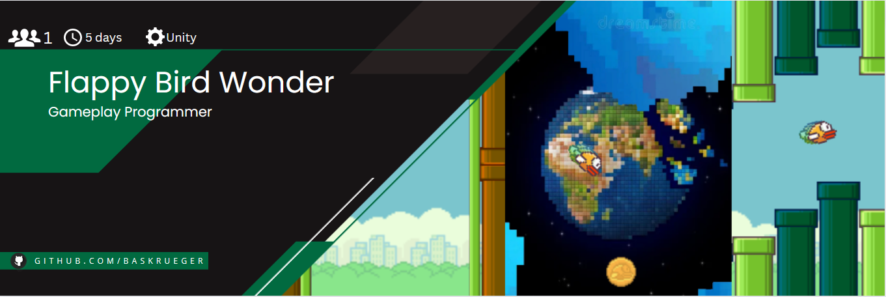

# Flappy Bird Wonder

     

Flappy Bird Wonder is a common flappy bird clone, but with a Mario Wonder inspired twist. This small project is the accumulated result of a couple spare hours where I got nothing better to do.

# Gameplay

https://github.com/BasKrueger/FlappyBirdWonder/assets/147401575/2aa57858-93ec-4919-afa7-0257229ce037

The game starts out as the flappy bird we all know and love, but every now and then you can encounter a wonder pipe, which lead you to one of the wonderlevels that put a truly wonderful spin on the classic formula. You might suddenly be in space, control the pipes instead of the bird or be traped in a bouncy cage.

# How to run
Clone this repository and open the project folder using at least Unity Version 2021.3.1. Alternatively you can play the latest build of the prototype right [here](https://suchti0352.itch.io/flappy-bird-wonder) in your browser.
